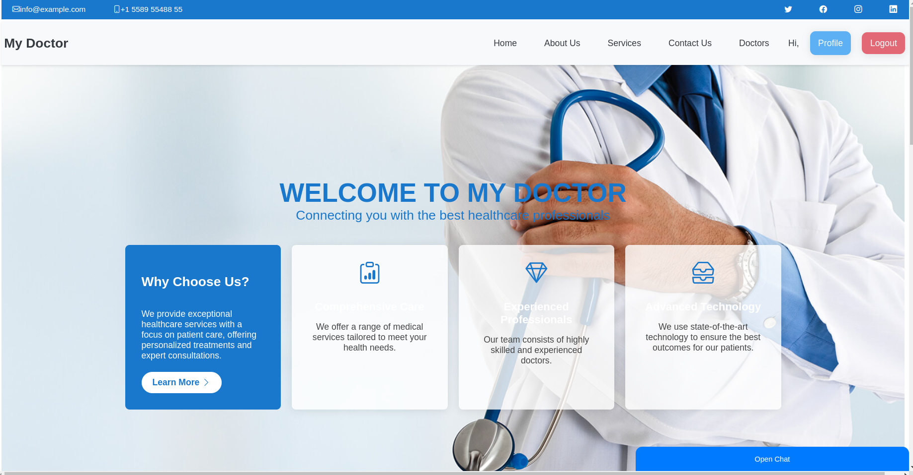
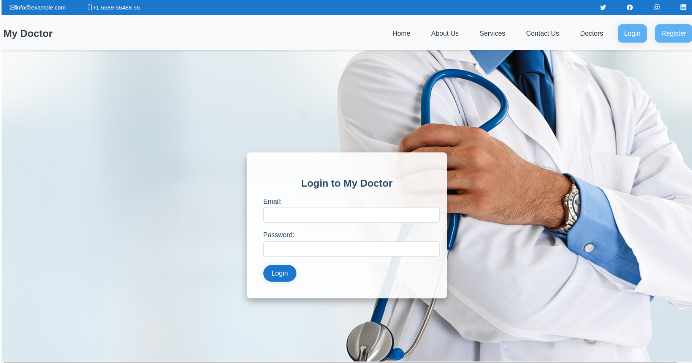
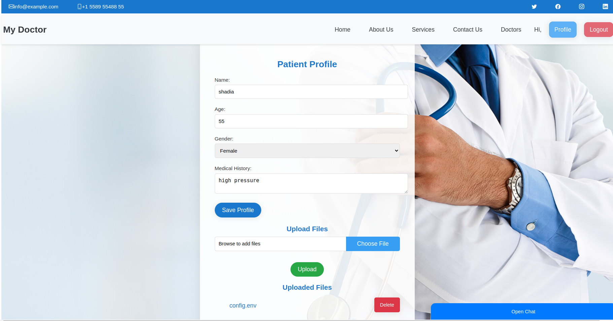
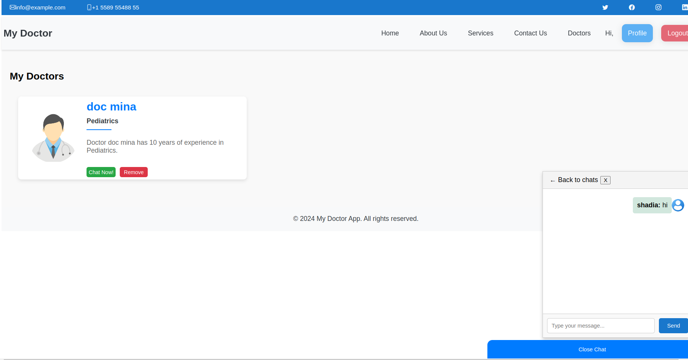

# My Doctor

**My Doctor** is a web-based application that aims to enhance communication and collaboration between patients and doctors. The platform provides features such as real-time chat, appointment scheduling, and file management, enabling seamless interaction between patients and healthcare providers.

## Features

- **Patient Results and Scans Upload**: Patients can upload their medical results and scans for doctors to review.
- **Real-Time Chat**: Patients and doctors can communicate directly through the chat feature.
- **Doctor Dashboard**: Doctors can manage their interactions with patients, view medical records, and keep track of appointments.
- **Appointment Scheduling**: Patients can book appointments with doctors based on their available schedules.

## Tech Stack

- **Backend**: Node.js, Express, MongoDB
- **Frontend**: React
- **Real-time Communication**: Socket.IO
- **File Storage**: AWS S3
- **Session Management**: Express Sessions

## Project Structure

```
My-Doctor/
│
├── backend/
│   ├── controllers/
│   │   ├── UserController.js
│   │   ├── DoctorController.js
│   │   ├── FilesController.js
│   │   └── ChatController.js
│   ├── models/
│   │   ├── User.js
│   │   ├── Doctor.js
│   │   ├── Patient.js
│   │   ├── File.js
│   │   ├── Chat.js
│   │   └── Message.js
│   ├── routes/
│   │   ├── userRoutes.js
│   │   ├── doctorRoutes.js
│   │   ├── fileRoutes.js
│   │   └── chatRoutes.js
│   ├── services/
│   │   ├── authService.js
│   │   └── fileService.js
│   ├── utils/
│   │   ├── s3Uploader.js
│   │   └── socketHandler.js
│   ├── app.js
│   └── server.js
│
├── frontend/
│   ├── src/
│   │   ├── components/
│   │   │   ├── Chat.js
│   │   │   ├── DoctorDashboard.js
│   │   │   ├── FileUpload.js
│   │   │   └── AppointmentScheduler.js
│   │   ├── pages/
│   │   │   ├── Login.js
│   │   │   ├── Register.js
│   │   │   └── Profile.js
│   │   ├── services/
│   │   │   ├── apiService.js
│   │   │   └── authService.js
│   │   ├── App.js
│   │   └── index.js
│   └── public/
│       ├── index.html
│       └── favicon.ico
│
└── README.md
```

## Installation

### Backend

1. Clone the repository:
   ```bash
   git clone https://github.com/mena5800/My-Doctor.git
   cd My-Doctor/backend
   ```
2. Install dependencies:
   ```bash
   npm install
   ```
3. Set up environment variables:
   Create a `.env` file in the backend directory with the following variables:
   ```plaintext
   MONGODB_URI=your_mongodb_uri
   JWT_SECRET=your_jwt_secret
   AWS_ACCESS_KEY_ID=your_aws_access_key_id
   AWS_SECRET_ACCESS_KEY=your_aws_secret_access_key
   S3_BUCKET_NAME=your_s3_bucket_name
   ```
4. Start the server:
   ```bash
   npm run start-server
   ```

### Frontend

1. Navigate to the frontend directory:
   ```bash
   cd My-Doctor/frontend
   ```
2. Install dependencies:
   ```bash
   npm install
   ```
3. Start the React application:
   ```bash
   npm start
   ```
3. Set up environment variables:
   Create a `.env` file in the backend directory with the following variables:
   ```plaintext
   API_BASE=API_BASE_URL
   BACKEND_SERVER=BACKEND_URL
   ```


## API Endpoints

### User

- **POST /api/users/register** - Register a new user (patient/doctor)
- **POST /api/users/login** - Login a user
- **GET /api/users/profile** - Retrieve user profile
- **PUT /api/users/profile** - Update user profile

### Doctor

- **GET /api/doctors** - Get all doctors
- **POST /api/doctors/addPatient** - Add a patient to a doctor's list
- **GET /api/doctors/:id/patients** - Get all patients of a doctor

### File

- **POST /api/files/upload** - Upload a file
- **GET /api/files/:id** - Get a file by ID
- **DELETE /api/files/:id** - Delete a file by ID

### Chat

- **POST /api/chats** - Create a new chat
- **GET /api/chats/:id/messages** - Get all messages in a chat
- **POST /api/chats/:id/messages** - Send a message in a chat

## Real-Time Communication

Socket.IO is used to handle real-time messaging between users. The backend establishes a WebSocket connection with the frontend to facilitate instant communication.

## AWS S3 Integration

Files uploaded by users are stored in AWS S3 buckets. The `s3Uploader.js` utility handles file uploads and management in S3.

---

# screenshots

## Home Page



## Log In Page



## Profile Page



## Chat Page



